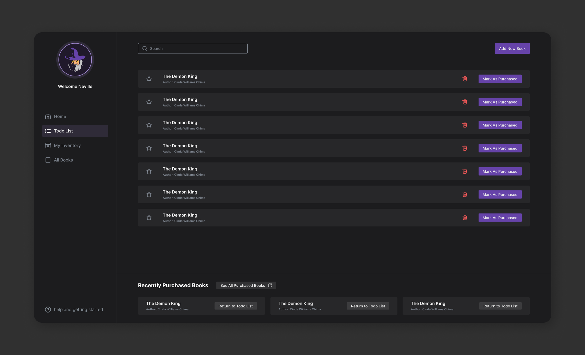
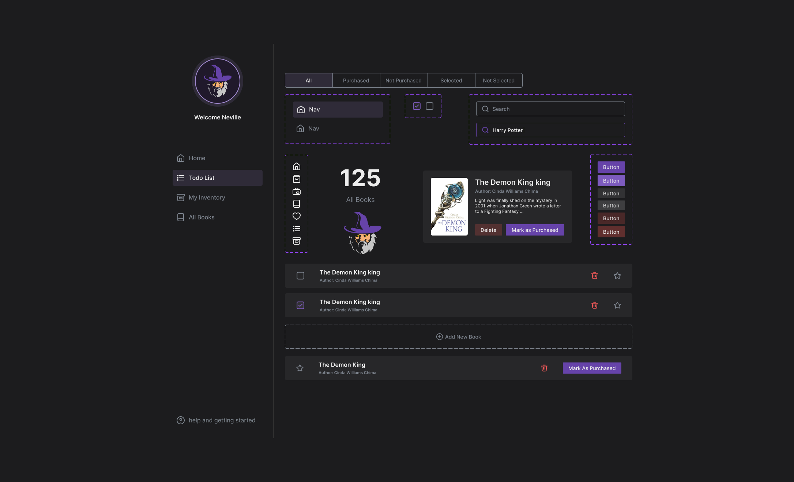

# Quick Quills List Maker


## Description

There is a wizard (let’s call him Neville) who wants to buy some books for going to his
wizardry school before a new year of school starts. But Neville is quite forgetful and asked
his very good friend, the Head of the Department of Frontend Sorcery, to build him a
magical application which helps him make a Todo list of the books that he needs to buy, and
show the ones he has already bought from the Magical inventory of available books.

[Click to see demo](https://quick-quills.vercel.app/home)

## Start the app

```
npm install
```

```
npx nx run-many -t serve
```

Open your browser and navigate to http://localhost:4200/. Happy coding!

## Glossary

- **Book**
  - **id** : A unique identifier for the book. Each book in the collection should have a distinct id
  - **Title**: The title of the book. It represents the name or title given to the book
  - **Author**: The name of the author who wrote the book. It indicates the person responsible for creating the content.
  - **isPurchased** : A boolean flag indicating whether the book has been purchased. If true, the book has been bought; if false, it has not been purchased
  - **purchaseDate**: The date when the book was purchased. It is represented as a string or null if the book has not been purchased. If the book is purchased, this property holds the date of purchase.
- **Todo List**: A list of books that the user wants to buy.
- **My Inventory** : A list of all books that user bought.
- **All Books** : A list of all books.

## Want better Editor Integration?

Have a look at the [Nx Console extensions](https://nx.dev/nx-console). It provides autocomplete support, a UI for exploring and running tasks & generators, and more! Available for VSCode, IntelliJ and comes with a LSP for Vim users.

## Ready to deploy?

Just run `npx nx run-many -t build` to build the application. The build artifacts will be stored in the `dist/` directory, ready to be deployed.

## Good to mention

- Type checking before each commit with `nx affected` command;
- internationalization with `nextjs-intl`

## Tech Stack

`nx`, `react-query`, `nextjs`, `express`, `json-server`, `cypress`

## UI/UX

**Design Choices** :

- **Colors**:
  - **Dark Theme**: Dark themes are often associated with a modern and sleek aesthetic. They provide a sophisticated and visually pleasing look.
  - **Purple Brand Color**: Purple is often associated with magic, mystery, and creativity. It's a color that carries a sense of enchantment and aligns well with the theme of wizardry.
- **Quick Access Section**: I had two choices, display purchased books on the same page as the Todo list or move them to another page. Showing purchased books on the Todo list page provides quick confirmation and easy access to completed tasks but may lead to visual clutter. On the other hand, moving purchased books to a separate "My Inventory" page keeps the Todo list clean but may require additional navigation steps. So I implemented a hybrid approach.




## Bad Practices

Some of bad practices that I followed intentionally:

- Large and not feature-specific git commits.
- Not writing tests (because of time pressure).
- Some DRY violations.
- Not having CI (because of time pressure).
- Naming inconsistency (because I didn't write the Glossary at first).
- UX violations (after book deletion user should see a message that book has been deleted, ...).
- Not being responsive. I recommend to use this dashboard in a Full HD displays.
- Not completely internationalized.
